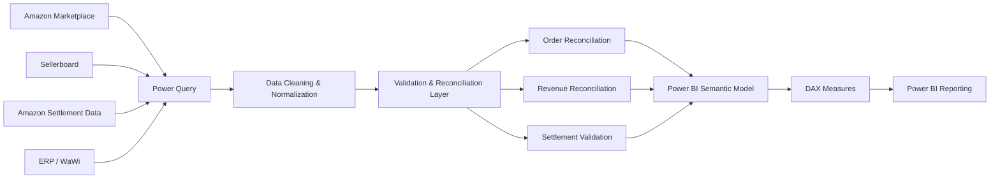

# Data Architecture

This diagram shows the high-level reconciliation architecture used in this Power BI case study.

## Reconciliation Principle

The architecture does not assume that different source systems must produce identical values.

Instead, the reconciliation layer is used to identify, quantify, and explain differences caused by factors such as:

- different order definitions
- cancellations
- split transactions
- settlement timing
- gross vs. net revenue
- VAT treatment
- inconsistent date contexts
- source-specific business rules

The objective is a transparent and traceable reconciliation process rather than artificially forcing the source systems to match.
